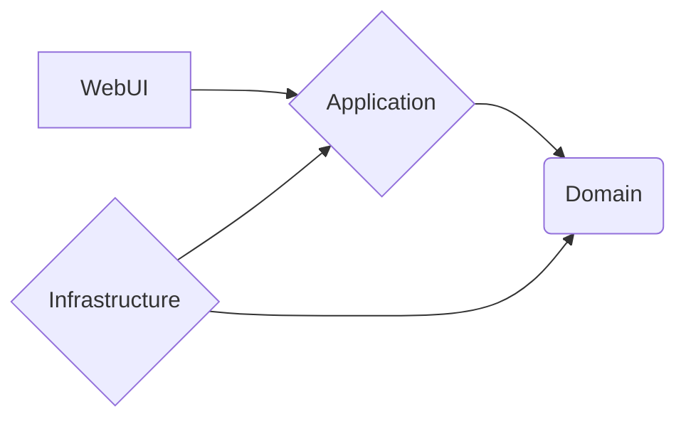

# Green Crop  

Web API + SPA Project

## Technologies
The project has been developed using the below technologies.

-   [ASP.NET Core](https://get.asp.net/) 5 and [C#](https://msdn.microsoft.com/en-us/library/67ef8sbd.aspx) for cross-platform server-side code
-   [Angular](https://angular.io/) 8 and [TypeScript](http://www.typescriptlang.org/) for client-side code
-   ~~[Bootstrap](http://getbootstrap.com/) for layout and styling~~

## Requirements
- .NET Core 5
- Node.js

## How to run ??

| What               |Folder                          |Command                         |  Port
|----------------|-------------------------------|-----------------------------|-----------------------------|
|Web Api 		|src\WebUI            |`dotnet run`            | https://localhost:5001
|SPA          |src\WebUI\ClientApp            |`npm start`            | https://localhost:4200

## How to test ??
one the project root folder, run `dotnet test`

## Architecture

### Layers

